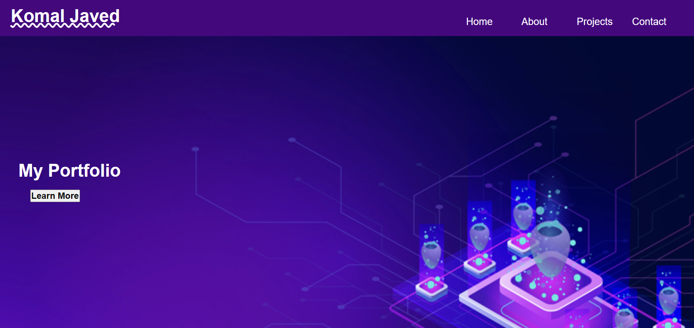

# KJ-portfolio

WHEN I load their portfolio
THEN I am presented with the developer's name, a recent photo or avatar, and links to sections about them, their work, and how to contact them
WHEN I click one of the links in the navigation
THEN the UI scrolls to the corresponding section
WHEN I click on the link to the section about their work
THEN the UI scrolls to a section with titled images of the developer's applications
WHEN I am presented with the developer's first application
THEN that application's image should be larger in size than the others
WHEN I click on the images of the applications
THEN I am taken to that deployed application
WHEN I resize the page or view the site on various screens and devices
THEN I am presented with a responsive layout that adapts to my viewport

## The above is criteria that I have to work against
*   Through my Work I have added my own name in a h1 tag, my own photo should be added, and links to projects or work i have done previously. a contact section is also there.
* When clicking on anyhting in the nav it should scroll down to the corresponding section.
* There is a Projects link in my nav which will scroll down to all the work i have done so far
* Images will lead you the application  on the same webpage.
* I have tried to make the webpage more responsive using the @ media screen - some difficulties using this.

## Difficulties

* The dsesign of the page was quite difficult - when starting to create my own application it was hard to find what to do and where to place everyhting. 
* Getting alot of the information to be inline such as the placeholder images.
* Making the webpage be more responsive for example everything is stacked below one another when shortening the screen.

## The project

This project was to create my own website - which happens to be a portfolio that will showcase all my work. See the below image. The portfolio does show some upcoming projects on the page.

## Installation 

The website has been published using GitHub - all you need to do is follow the link below to access the website.

## Links

https://github.com/KJ234/KJ-portfolio.git  This is a link to my GitHub page

https://kj234.github.io/KJ-portfolio/  This is a link to my actual website